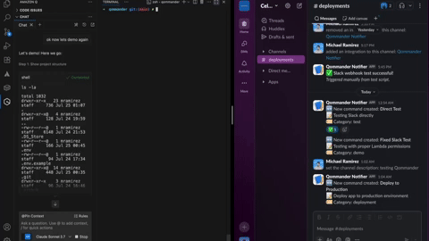
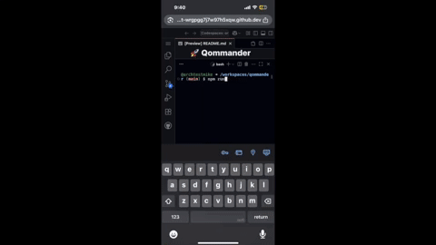
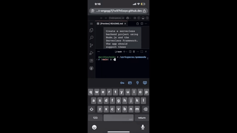
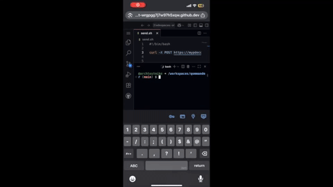

# 🚀 Qommander

**AI-powered DevOps automation — build, test, deploy, and notify your backend with a single Amazon Q prompt.**

Qommander is a fully serverless backend stack generated using [Amazon Q Developer](https://aws.amazon.com/q/developer/). From REST API routes to Slack notifications and CI/CD workflows, everything is scaffolded, tested, and deployable — instantly.

---

## 📽️ Live Demo (Slack + GitHub + Deploy Flow)



## 🎥 Demo Amazon Q in Action


---

## 🧠 Prompt Used with Amazon Q 

This entire backend stack was generated using a single prompt in [Amazon Q Developer](https://aws.amazon.com/q/developer/):

```text
Create a serverless backend project using Node.js and the Serverless Framework. The app should support these features:

1. Lambda functions to:
   - Create a command entry
   - Fetch a command by ID
   - Archive a command
   - Post a weekly changelog to Slack

2. Include Slack notification integration via webhook (from `.env`)

3. Generate a `serverless.yml` with all functions properly defined and deployed to AWS.

4. Add a basic CI/CD pipeline using GitHub Actions (for testing and deployment)

5. Include a Jest test file for each Lambda

6. Provide a script to generate Git changelog entries for the Slack post

7. Create a `pricing-breakdown.md` estimating cost of each Lambda function per month

8. Create a README explaining how to install, test, and deploy the service
```

---

### 📱 Mobile Demo – Deploy on the Go


### 🧪 Mobile Demo – Run Tests


### 💬 Mobile Demo – Slack Alert in Action



---


## ✨ Features

- 🧠 Built entirely by prompting Amazon Q
- 🛠️ Modular Lambda handlers (`handlers/`)
- 📬 Slack webhook integration (via `.env`)
- 🧪 Unit tests (Jest)
- 🚀 GitHub Actions workflow for CI/CD
- 📝 Weekly Git changelog poster (Slack)
- 💸 `pricing-breakdown.md` for cost awareness
- 📱 Mobile CLI-compatible via Codespaces

---

## 📦 Project Structure

```
qommander/
├── handlers/             # Lambda functions
├── tests/                # Jest test coverage
├── scripts/              # Git changelog → Slack
├── .github/workflows/    # CI/CD pipeline
├── pricing-breakdown.md  # Cost estimation
├── serverless.yml        # Serverless Framework config
├── .env.example          # Environment variable template
├── demo/qommander-demo-15s-sharp-safe.gif  # Inline GIF demo
├── README.md             # You're here
```

---

## ⚙️ How to Use

```bash
npm install       # Install dependencies
npm test          # Run Jest tests
sls deploy        # Deploy via Serverless Framework
```

---

## 💡 Slack Webhook Setup

1. Create a [Slack Webhook](https://api.slack.com/messaging/webhooks)
2. Paste it into `.env`:

```env
SLACK_WEBHOOK_URL=https://hooks.slack.com/services/your/webhook/url
```

---

## 🧠 Why Qommander?

This project showcases Amazon Q's ability to:
- Generate full backend logic
- Automate CI/CD pipelines
- Improve productivity and visibility for dev teams

---

## 🏁 Ready to Try It?

```bash
git clone https://github.com/archtestmike/qommander
cd qommander
cp .env.example .env
npm install
sls deploy
```

---

## 📣 Amazon Q Developer Challenge Submission

**Challenge**: [Unlock Your Productivity Potential](https://builder.aws.com/content/2zZHZXurlEsbElK93n76qgqBRRJ/unlock-your-productivity-potential-join-q-developer-challenge-1)

### **Productivity Impact**:
- **Before Q**: Multi-day serverless project setup
- **With Q**: Complete backend generated in hours
- **Multiplier**: 10x faster development cycle

### **What Amazon Q Generated**:
- ✅ 5 Lambda functions with business logic
- ✅ 15 comprehensive unit tests
- ✅ GitHub Actions CI/CD pipeline
- ✅ DynamoDB schema and serverless config
- ✅ Complete documentation and cost analysis
- ✅ Production-ready error handling

**Repository**: https://github.com/archtestmike/qommander  
**Live Demo**: Slack notifications + REST API working

Showcases Amazon Q's ability to generate complete, production-ready infrastructure from simple prompts.
